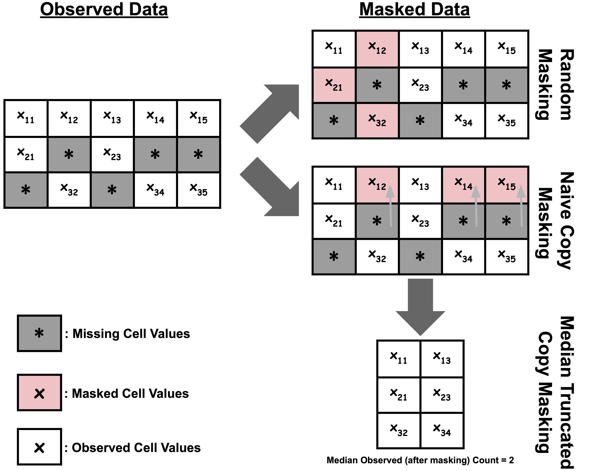

# 🌵 CACTI: Context Aware Copy maksed Tabular Imputation

<!-- badges: start -->


[](https://github.com/sriramlab/CACTI/pulls)

<!-- badges: end -->


This is the offical repo for implemetation of the **C**ontext **A**ware **C**opy masked **T**abular **I**mputation (CACTI). The code here will allow users to run CACTI on any dataset and also reproduce its benchmakring results in the ICML'25 spotlight paper: "*CACTI: Leveraging Copy Masking and Contextual Information to Improve Tabular Data Imputation*."

## CACTI Overview


CACTI samples observed missingness patterns to generate masks via Median Truncated Copy Masking (MT-CM) to guide the learning. Features' context are also embedded with a language model. The MT-CM strategy masks out some portion of the observed features from sample $n$ using observed missingness patterns from other samples ($j$) in the same dataset. This is followed by concatenating context information to the remaining (unmasked) features. 
A transformer encoder processes this data. Then the model adds context information and [MASK] tokens for the missing/masked features before being processed by the decoding transformer which reconstructs the values. \MName optimizes reconstruction loss ($\mathcal{L}_{CACTI}$) over observed and masked features to produce the final imputation estimates.



In contrast to random masking, where some subset of random features are masked, copy masking recycles missing-value patterns actually present in the dataset.
This approach simulates realistic missingness patterns that provide a source of useful inductive bias during training. Median Truncated Copy Masking extends this strategy for MAE training by truncating the number of features available to the encoder, ensuring it has access to at most the median number of fully observed features in each batch.

## Installation
Please install the following conda environment to run CACTI:
``` python
conda env create -n cacti -f environment.yml
conda activate cacti
pip install ucimlrepo==0.0.7

# If you would like to create simulated missingness mask 
# install the following as well;
# However, note that this will download a whole host of 
# anciliary packages from HyperImpute requirements.txt
pip install hyperimpute
```

## Generating UCI ML Datasets
Run the following create all 10 UCI ML dataset, simmulate the 3 missingness scenarios, make train/test splits:

``` python
python tools/createsplits_ucidata.py --data all \
    --mechanism all --pmiss 0.3 \
    --pval 0.2 --nrep 3 \
    --odir <DATA_DIR>
```

Next, we will extract and embed the column infomation/context into embeddings (this is a one time process):

``` bash 
for DS in bike obesity california default income letter magic shoppers spam students; do 
    python tools/precompute_colembed.py \
        --desc_file <DATA_DIR>/uciml/${DS}/${DS}-mcar-30/colinfo.tsv \
        --out <DATA_DIR>/uciml/${DS}/ \
        --mode BERT --embed_model Alibaba-NLP/gte-en-mlm-large \
        --fname embeddings_colnames_GTEenMLMlarge; 
done
```

## Usage
To train and make inference on training dataset only use the following command stcuture:
``` python
python train.py --project <PROJECT_NAME> --model CACTI \
            --checkpoint_id CACTI-cpkt \
            --tabular <DATA_DIR>/uciml/obesity/obesity-mnar-30/ptrain-1.tsv \
            --embeddings <DATA_DIR>/uciml/obesity/embeddings_colnames_GTEenMLMlarge.npz \
            --log_path <LOG_DIR> \
            --mask_ratio 0.9 --batch_size 128 --epochs 300 \
            --num_workers 4 --gpus 0 --lr 0.001 \
            --save_path <DATA_DIR>/CACTI-res/<PROJECT_NAME>/CACTI-cp90-ne10-nd4-es64/obesity/obesity-mnar-30  \
            --embed_dim 64 --nencoder 10 --ndecoder 4
```

To train and make inference on both training and test datasetsuse the following command stcuture:
``` python
python train.py --project <PROJECT_NAME> --model CACTI \
            --checkpoint_id CACTI-obesity-mnar-30-1-cpkt \
            --tabular <DATA_DIR>/uciml/obesity/obesity-mnar-30/ptrain-1.tsv \
            --tabular_infer <DATA_DIR>/uciml/obesity/obesity-mnar-30/pval-1.tsv \
            --embeddings <DATA_DIR>/uciml/obesity/embeddings_colnames_GTEenMLMlarge.npz \
            --log_path <LOG_DIR> \
            --mask_ratio 0.9 --batch_size 128 --epochs 300 \
            --num_workers 4 --gpus 0 --lr 0.001 \
            --save_path <DATA_DIR>/CACTI-res/<PROJECT_NAME>/CACTI-cp90-ne10-nd4-es64/obesity/obesity-mnar-30  \
            --embed_dim 64 --nencoder 10 --ndecoder 4
```

The following bash script can be used to iterate through all missingness condtions for a particualar dataset:

```bash
dataset=obesity # or any of : (bike obesity california default income letter magic shoppers spam students)
scenarios=(mar mcar mnar)
miss_rate=30

# Dir Paths
PROJECT=<PROJECT_NAME> # eg. CACTI-bmk
DATA_DIR=<DATA_DIR>/uciml/${dataset}/
LOG_DIR=<LOG_DIR>/${PROJECT}/
SAVE_DIR=<DATA_DIR>/CACTI-res/${PROJECT}/

# Run Settings
CPRATE=0.90
CPPCT=$(printf "%.0f" "$(echo "$CPRATE * 100" | bc)")
BSIZE=128
EPOCHS=600
EMBED=GTEenMLMlarge
model=CACTI
NENC=10
NDEC=4
EMD=64

for mtype in "${scenarios[@]}"; do
    for rep_index in 1 2 3; do
        ### CACTI : Main benchmark runs
        mname=${model}-cp${CPPCT}-ne${NENC}-nd${NDEC}-es${EMD}
        ckpt_id=${mname}-${dataset}-${mtype}-${miss_rate}-${rep_index}
        echo "SGE_TASK_ID :: MODEL ${PROJECT} ${mname} (cp:${CPPCT}, batch:${BSIZE}, epochs:${EPOCHS}): ${SGE_TASK_ID}, dataset: ${dataset}, scenario: ${mtype}, miss_rate: ${miss_rate}, rep_index: ${rep_index}, ctx_embeddig ${EMBED}"
        
        # Train+eval
        python train.py --project ${PROJECT} --model ${model} \
            --checkpoint_id ${ckpt_id} \
            --tabular ${DATA_DIR}/${dataset}-${mtype}-${miss_rate}/ptrain-${rep_index}.tsv \
            --tabular_infer ${DATA_DIR}/${dataset}-${mtype}-${miss_rate}/pval-${rep_index}.tsv \
            --embeddings ${DATA_DIR}/embeddings_colnames_${EMBED}.npz --log_path ${LOG_DIR} \
            --mask_ratio ${CPRATE} --batch_size ${BSIZE} --epochs ${EPOCHS} \
            --num_workers 4 --gpus 0 --lr 0.001 --save_path ${SAVE_DIR}/${mname}/${dataset}/${dataset}--${mtype}-${miss_rate} \
            --embed_dim ${EMD} --nencoder ${NENC} --ndecoder ${NDEC}
    done
done
```

### Calculate imputation metrics

To calculate the final imputation performacne metrics use the following script:
```bash
# assuming results are saved under <DATA_DIR>/CACTI-res/<PROJECT_NAME>/<METHOD_NAME>

python tools/uci_scoreeval.py --data_path <DATA_DIR>/uciml/ \
    --impute_path <DATA_DIR>/CACTI-res/<PROJECT_NAME> \
    --output_path <OUTPUT_DIR> \
    --num_replicates 3 \
    --method CACTI-cp90-ne10-nd4-es64     
```

## Citation
If you use this software in your research or find some of the key contributions of this work helpful, please cite our work as follows:
```bibtex
@inproceedings{gorla2025cacti,
  title = {CACTI: Leveraging Copy Masking and Contextual Information to Improve Tabular Data Imputation},
  author = {Aditya Gorla and Ryan Wang and Zhengtong Liu and Ulzee An and Sriram Sankararaman},
  booktitle = {Proceedings of the 42nd International Conference on Machine Learning (ICML)},
  year = {2025}
}
```

